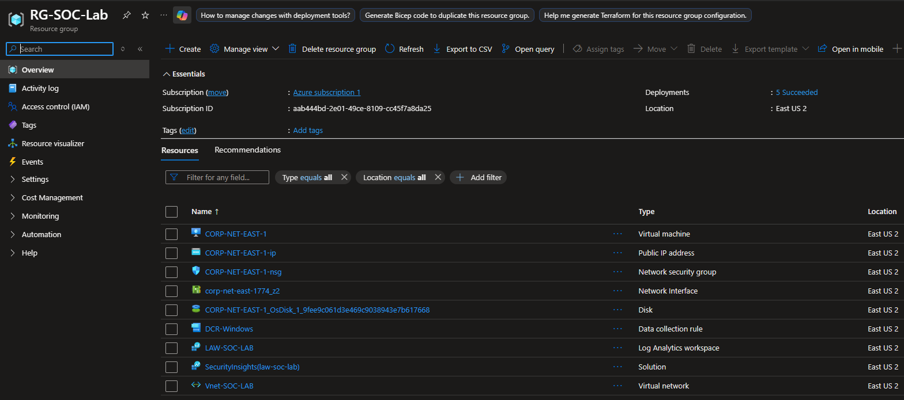
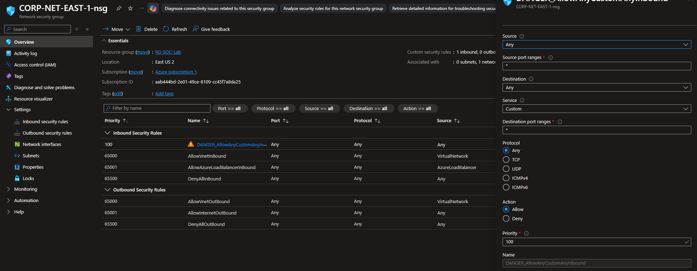
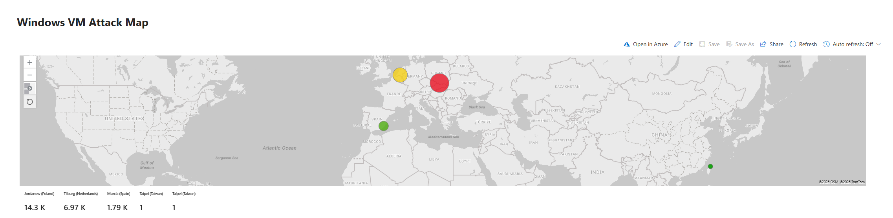

# Azure Sentinel SOC Honeypot Lab

This project demonstrates a cloud-based SOC lab built in **Microsoft Azure** using **Microsoft Sentinel SIEM**.  

An intentionally exposed Windows virtual machine was deployed as a **honeypot** to capture real-world attack traffic. Security logs were forwarded to a **Log Analytics Workspace**, analyzed with **KQL queries**, and visualized in **Microsoft Sentinel dashboards** to investigate attacker activity.

---

# Lab Architecture


The environment simulates a basic Security Operations Center workflow.

Internet  
↓  
Azure Virtual Machine (Honeypot)  
↓  
Azure Monitoring Agent  
↓  
Log Analytics Workspace  
↓  
Microsoft Sentinel (SIEM)

Attack attempts against the exposed VM are collected and analyzed through Sentinel.



---

# Environment Setup

The following Azure resources were deployed:

- Azure Resource Group
- Azure Virtual Network
- Windows Virtual Machine (Honeypot)
- Network Security Group (open to internet)
- Log Analytics Workspace
- Microsoft Sentinel SIEM

The VM firewall and network security group were intentionally opened to allow inbound traffic so attackers could discover and attempt to access the system.




---

# Log Collection

Security event logs from the VM were forwarded using the **Azure Monitoring Agent** to the **Log Analytics Workspace**, which acts as the centralized log repository.

These logs include:

- Failed login attempts
- Authentication activity
- Security events generated by Windows

Event ID **4625** was used to identify failed authentication attempts against the honeypot.

---

# Threat Investigation with KQL

Example query used to detect brute-force attempts:

```kql
SecurityEvent
| where EventID == 4625
| summarize FailedAttempts = count() by IpAddress, Account, bin(TimeGenerated, 5m)
| where FailedAttempts > 10
```

# Log Enrichment and Attacker Geolocation

After collecting authentication logs from the honeypot, the next step was to enrich the log data with geographic information to identify where attacks originate.

By default, the SecurityEvent logs in Log Analytics Workspace only contain the attacker IP address and do not include location data.

To resolve this, a GeoIP dataset was imported as a Microsoft Sentinel Watchlist. This dataset maps IP address ranges to geographic information such as country and coordinates.
Once imported, the watchlist contains ~54,000 IP ranges with associated geographic data.

In production environments, this type of location data is typically updated automatically by threat intelligence providers or security platforms.

---

# KQL Query for Log Enrichment

The following KQL query correlates failed login attempts with the GeoIP dataset to identify attacker locations.

```kql
let GeoIPDB_FULL = _GetWatchlist("geoip");
let WindowsEvents = SecurityEvent
    | where EventID == 4625
    | evaluate ipv4_lookup(GeoIPDB_FULL, IpAddress, network);
WindowsEvents
```
---

# Results

After enriching the logs with the GeoIP dataset, Microsoft Sentinel can display:

Attacker IP address

Country of origin

Latitude and longitude

Geographic location of attack attempts

This enriched data allows security analysts to quickly visualize attack sources and identify patterns in global attack traffic.

---

# Attack Visualization

A Sentinel Workbook was created to visualize attack traffic.

The workbook maps attacker IP addresses to geographic locations using an IP geolocation dataset and displays global attack activity on a map.

This allows rapid visualization of where attack attempts originate.


